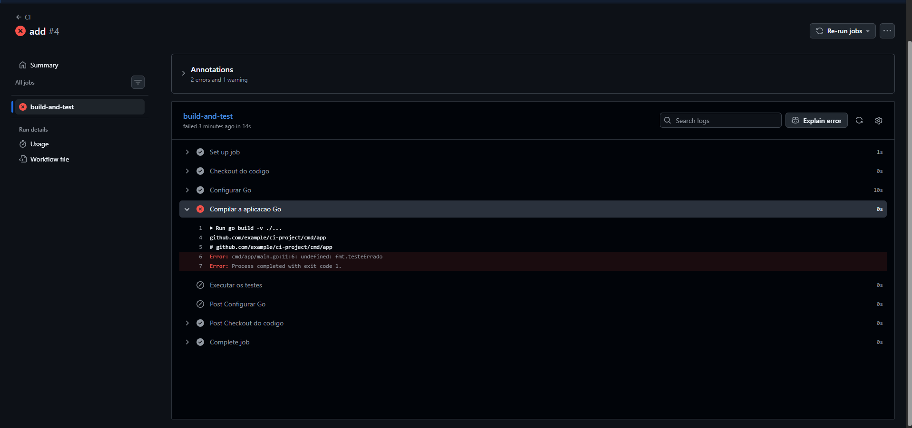

## questionario da atividade: 
1. Explique como a _pipeline_ é disparada no GitHub Actions. Na sua resposta, cite especificamente o que você configurou no arquivo `ci.yml`.

A pipeline é disparada (acionada) através dos eventos definidos na seção on do arquivo YAML. Na configuração da atividade, foi ajustado para disparar sempre que haver um push, ou um pull request.

2. O que é um _runner_ no GitHub Actions e qual o seu papel na execução da _pipeline_?

Um runner é a máquina (geralmente uma máquina virtual ou um container) que recebe e executa os trabalhos (jobs) definidos na sua pipeline. O papel dele é fornecer o poder computacional (CPU, memória) e o sistema operacional básico para rodar os seus comandos.

3. Qual a diferença entre _buildar_ a aplicação inteira como binário e _buildar_ a imagem Docker?

***Buildar o binário:*** É pegado o código-fonte e traduzido para um arquivo executável. Esse arquivo contém apenas a aplicação e dependerá da máquina onde for executado para rodar com sucesso.

***Buildar a imagem Docker:*** É cirado um pacote completo, a imagem Docker contém não apenas o binário compilado, mas também uma versão mínima de um sistema operacional e todas as dependências de ambiente que a aplicação precisa.

4. Por que usar Docker em uma _pipeline_ CI pode ser útil?

Usar Docker em uma pipeline de CI é extremamente útil porque ele resolve o problema do "na minha máquina funciona" ao empacotar o código junto com seu ambiente, garantindo que a aplicação rode de forma idêntica no desenvolvimento, no CI e em produção. Além de proporcionar um isolamento rigoroso, evitando que resquícios de testes anteriores interfiram na execução atual, o processo gera como resultado um artefato final padronizado e pronto para deploy, que pode ser rapidamente enviado para um registro e implantado em qualquer infraestrutura de nuvem.

5. Altere temporariamente o código para fazer um teste falhar.

- O que aconteceu com o pipeline?

Tentou rodar a compilação do codigo, porem quebrou por causa do fmt.testeErrado.

- Em qual etapa ele falhou?

foi na etapa "Compilar a aplicacao Go"

